# Terraform AWS Infrastructure Provisioning

## Overview

Provisioned a complete AWS environment using Terraform HCL-VPC with public subnet, Internet Gateway, route tables, and an EC2 instance bootstrapped with Apache via user_data. Followed standard five-file structure and extracted a reusable VPC module, demonstrating the plan/apply/destroy workflow and remote state management.

## Architecture

- **VPC** (`10.0.0.0/16`) with DNS support/hostnames enabled
- **Public subnet** (`10.0.1.0/24`) with auto-assign public IP
- **Internet Gateway** + public route table (routes `0.0.0.0/0` to IGW)
- **Security group** allowing inbound SSH (22) and HTTP (80) from anywhere, all outbound
- **Key pair** imported from local public key
- **EC2 instance** (t3.micro) with user_data bootstrapping Apache on boot

## Tech Stack

- Terraform (AWS provider)
- AWS: VPC, Subnet, Internet Gateway, Route Table, Security Group, Key Pair, EC2
- Apache2 (installed via user_data)

## Project Structure

```
aws-infra-terraform/
├── main.tf                      # Root resources: SG, key pair, EC2
├── variables.tf                 # Input variables
├── outputs.tf                   # Output values
├── providers.tf                 # Provider configuration
├── modules/
│   └── vpc/                     # VPC, subnet, IGW, route table module
├── screenshots
└── README.md
```

## How to Run

```bash
# Clone and enter the project
git clone https://github.com/ziqkimi308/aws-infra-terraform.git
cd aws-infra-terraform

# Fill in your own values into terraform.tfvars

# Initialize, plan, apply
terraform init
terraform plan
terraform apply

# Check outputs anytime
terraform output

# Tear down when done
terraform destroy
```

## Problems Faced & Fixes

**Issue:**
<br/>Website returned `ERR_CONNECTION_TIMED_OUT` — Apache never started.

**Investigation:**
<br/>Security group was correctly attached (`tf-devops-ec2-sg`, not default) with port 80 open, ruling out network config. SSH into the instance showed `apache2.service could not be found`.

**Root cause:**
<br/>`sudo cloud-init status` showed `status: error`, and `/var/log/cloud-init-output.log` showed the `cc_scripts_user` module failed. Mixed tabs/spaces inside the Terraform `<<-EOF` heredoc corrupted the shebang line, so the user_data script never executed.

**Fix:**
<br/>Removed all leading whitespace from heredoc lines in `user_data`. Recreated the instance (`terraform destroy` → `terraform apply`) to pick up the corrected script. Verified with `curl` and browser — Apache served the page correctly on the new IP.

## Screenshots

### 1. Terraform installed & version check

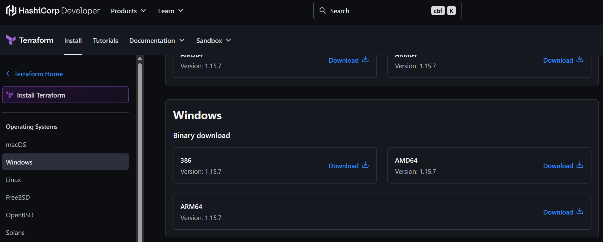

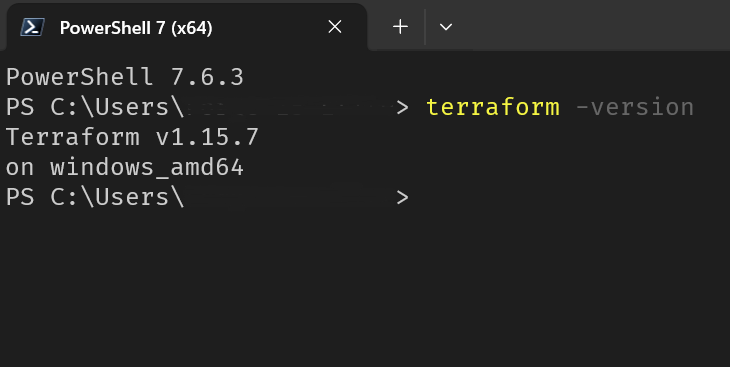

### 2. Terraform init

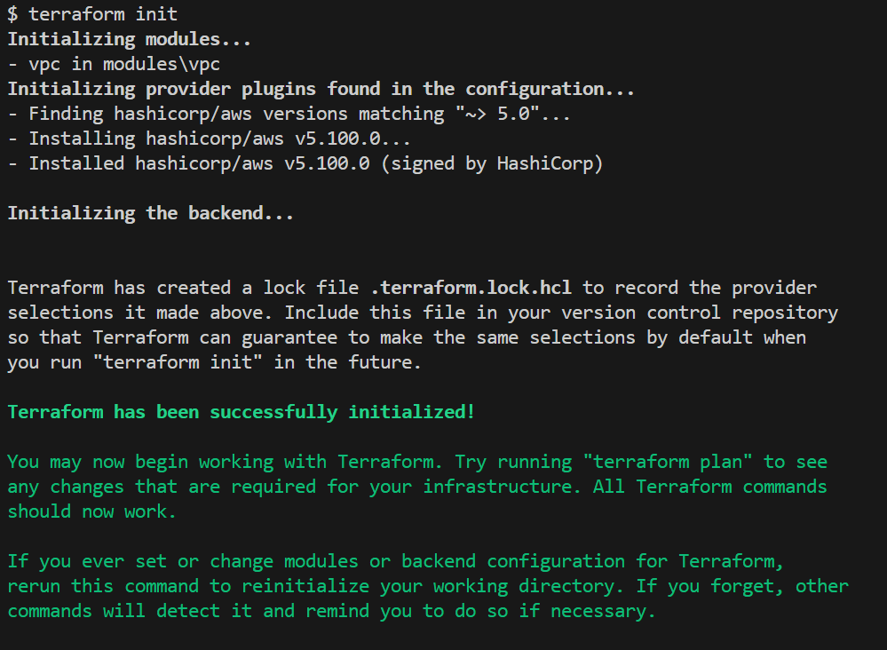

### 3. Terraform plan output

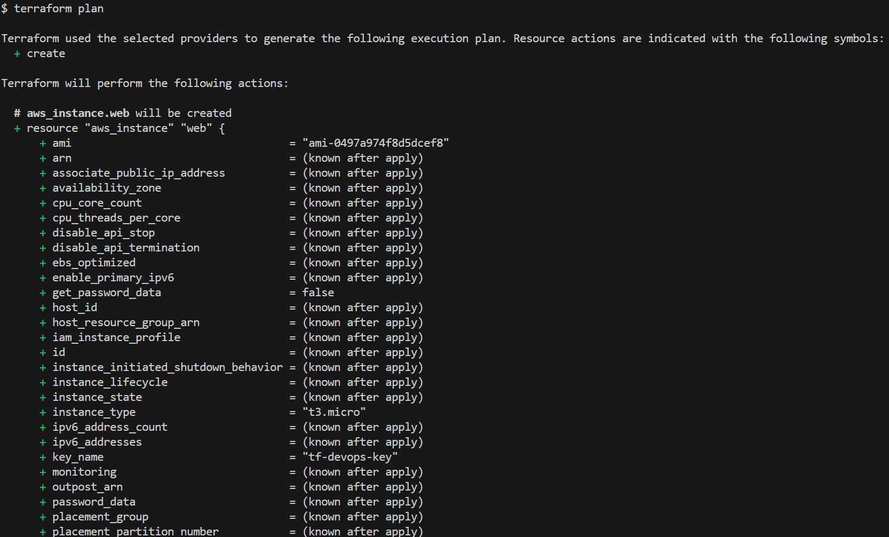

### 4. Terraform apply (first run)

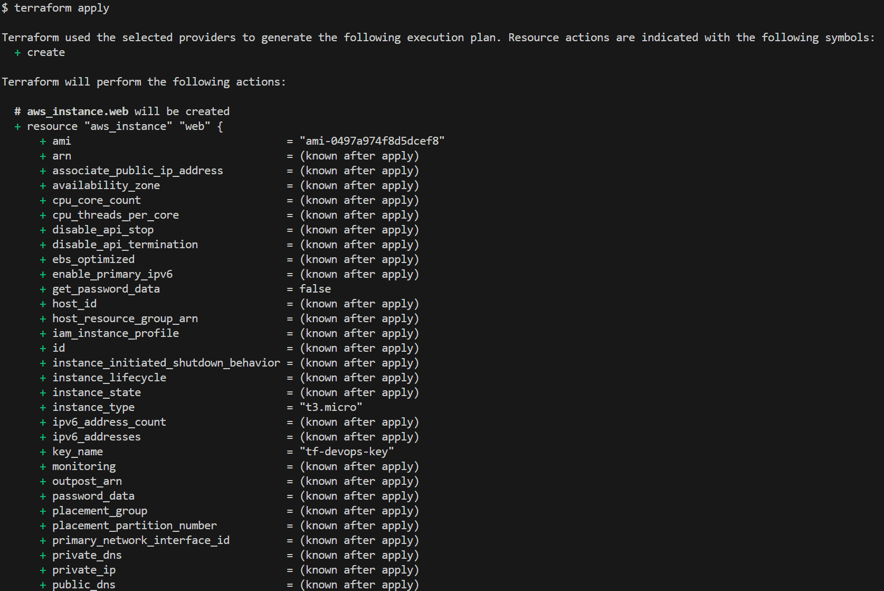

### 5. Website error — connection timed out

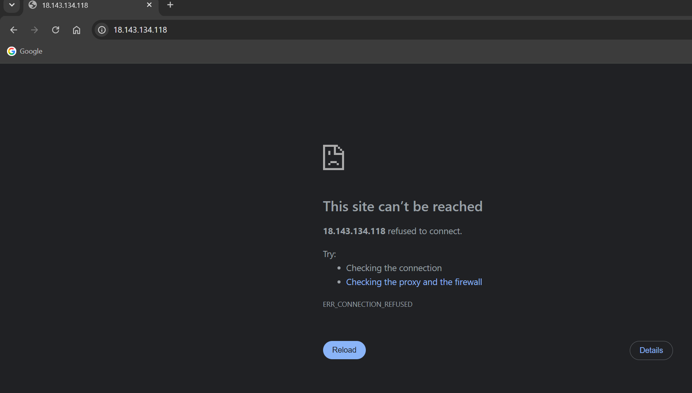

### 6. Troubleshooting the site error (SG check, SSH, cloud-init logs)

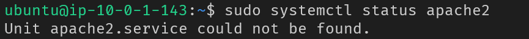

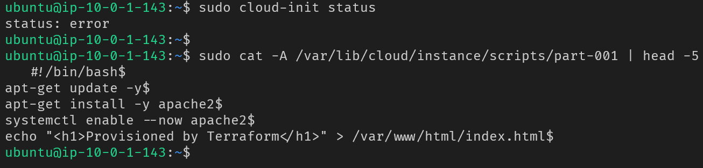

### 7. Fix applied, re-ran apply

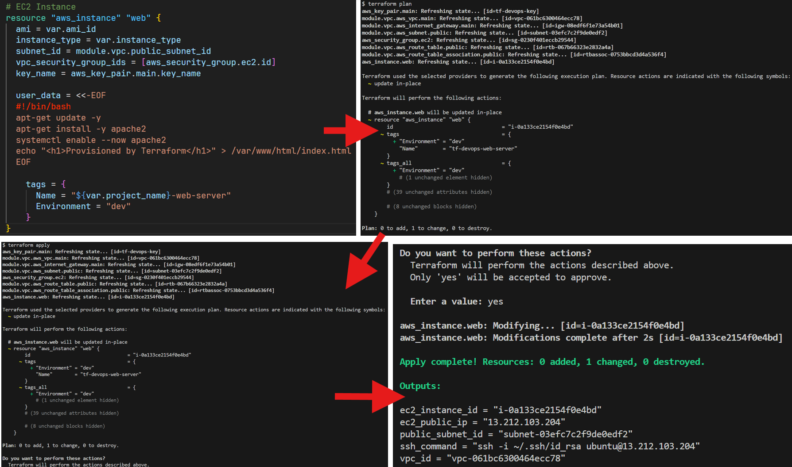

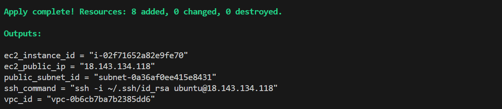

### 8. EC2 instance running in console

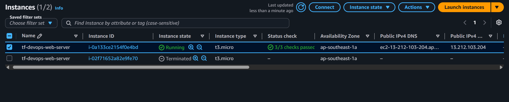

### 9. Website working — Apache serving page

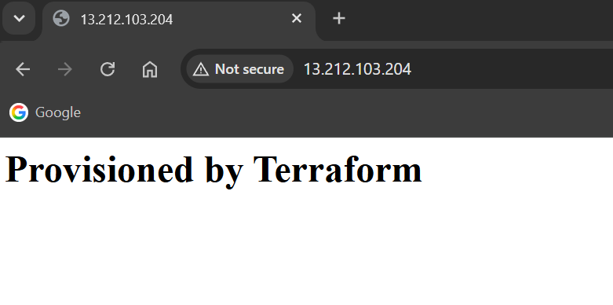

### 10. Terraform output command & result

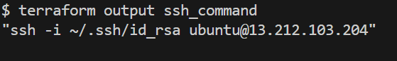

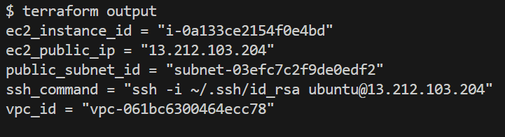

### 11. Terraform state list / state show

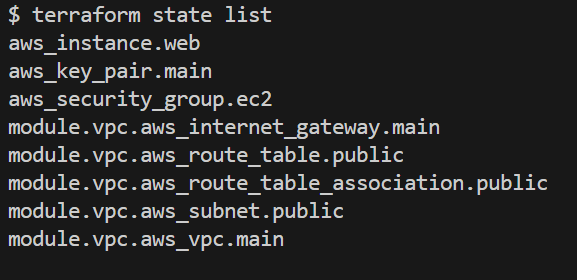

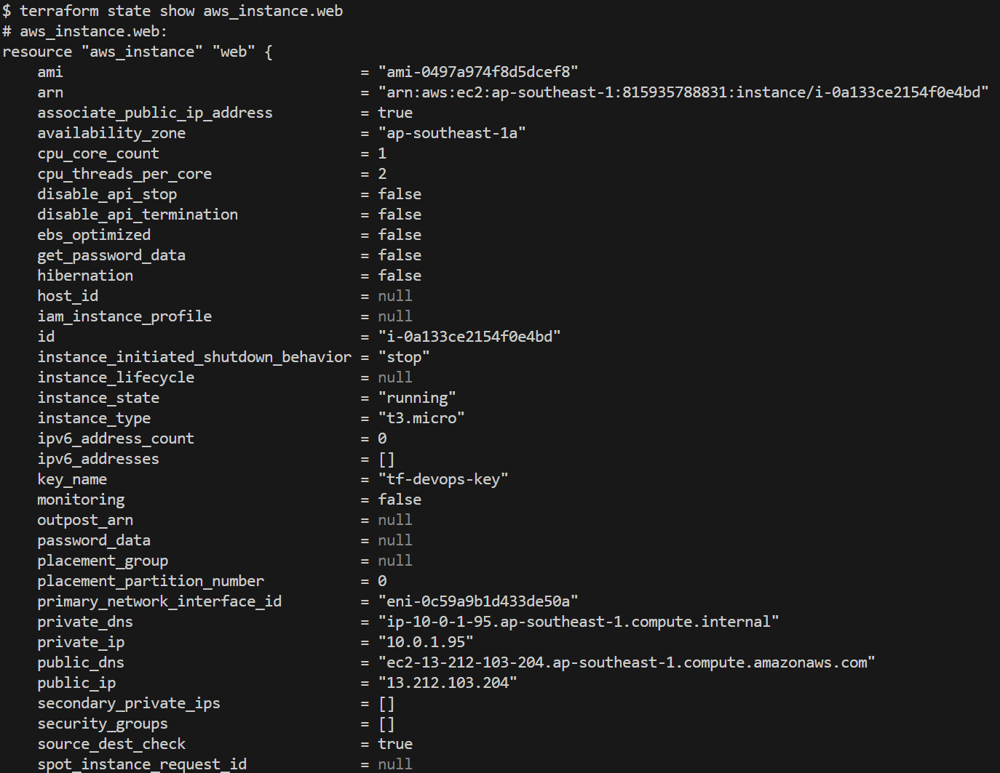

### 12. Terraform destroy (teardown)

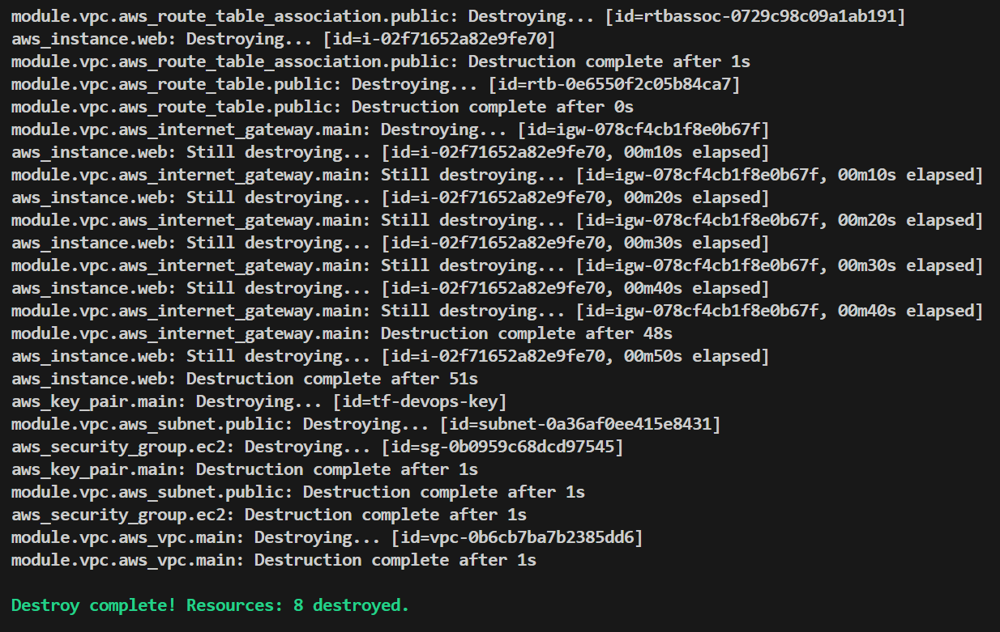

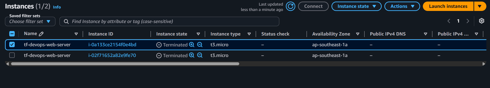


## Notes

- State files and real `.tfvars` are excluded from this repo via `.gitignore` — see `terraform.tfvars.example` for the variable structure.
- Instance was recreated fresh for this project (per personal practice policy of not reusing prior infra).
- Never edit `terraform.tfstate` by hand — use `terraform state` subcommands (`list`, `show`, `mv`, `rm`) instead.
